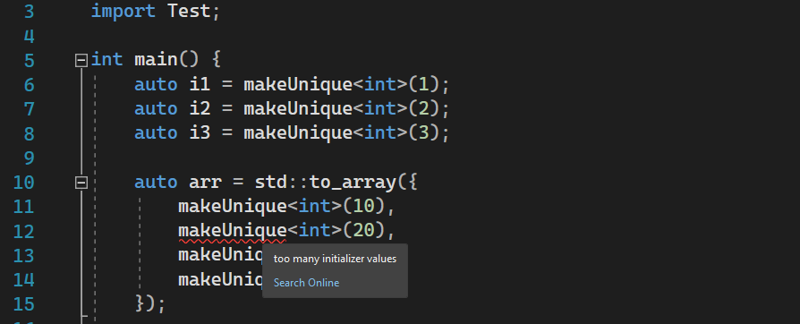
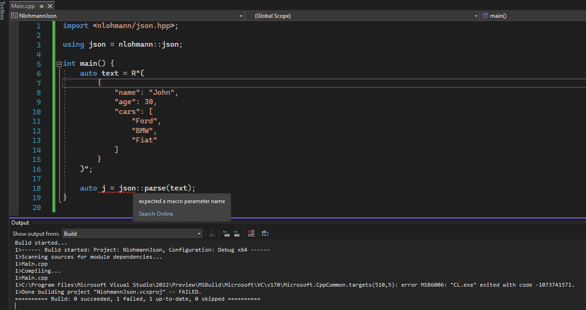

# Visual Studio Modules Testing

Some projects used for reporting errors in Visual Studio C++20 modules implementation.

## Project list

- [**AutoRetFromTemplate**](AutoRetFromTemplate)  
**Brief description:** Intellisense doesn't work when exported function template uses `auto` return type.  
**Tested on**: Visual Studio 2022 17.2.0 Preview 5.0  
**Ticket**: [Developer Community Link](https://developercommunity.visualstudio.com/t/C20-Modules---IntelliSense-breaks-when/10024161)  
**Overview:**  
  
**Video overview**: [YouTube Link](https://www.youtube.com/watch?v=BM4sMa4U07Y)

- [**NlohmannJson**](NlohmannJson)  
**Brief description:** [nlohmann/json](https://github.com/nlohmann/json) (downloaded `include` folder at tag `v3.10.5`) causes ICE when imported with C++20 modules. Error info: `error MSB6006: "CL.exe" exited with code -1073741571`  
**Tested on**: Visual Studio 2022 17.2.0 Preview 5.0  
**Ticket**: [Developer Community Link](https://developercommunity.visualstudio.com/t/C20-Modules---ICE-when-importing-nlohm/10024182)  
**Overview:**

// More on the way
